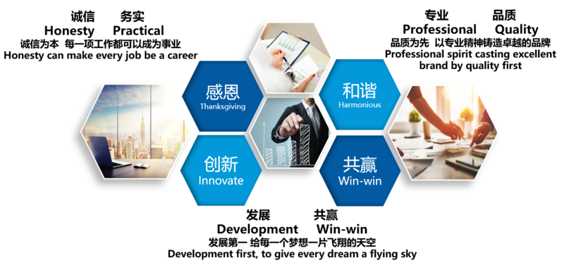

+++
title = "关于融禾"
description = "about herong"
+++

## 昆山融禾电子科技有限公司

昆山融禾电子科技有限公司正式创立于2018年1月，公司位于前进西路1288号万象汇商业中心2号楼2707室。专注于智能化方案设计及施工落地。主要从事各领域弱电类全面服务，从事计算机软硬件产品代理及销售、系统集成、软件开发、技术服务、互联网服务和计算机网络工程等，是提供全面的系统维护服务的综合性公司。且还涉及楼宇设备自控系统工程、保安监控及防盗报警系统、智能卡系统工程、通讯系统工程、会议系统工程、视屏点播系统工程、智能化小区综合物业管理系统工程、智能灯光、音响控制系统工程、火灾报警系统工程等。

## 企业文化

