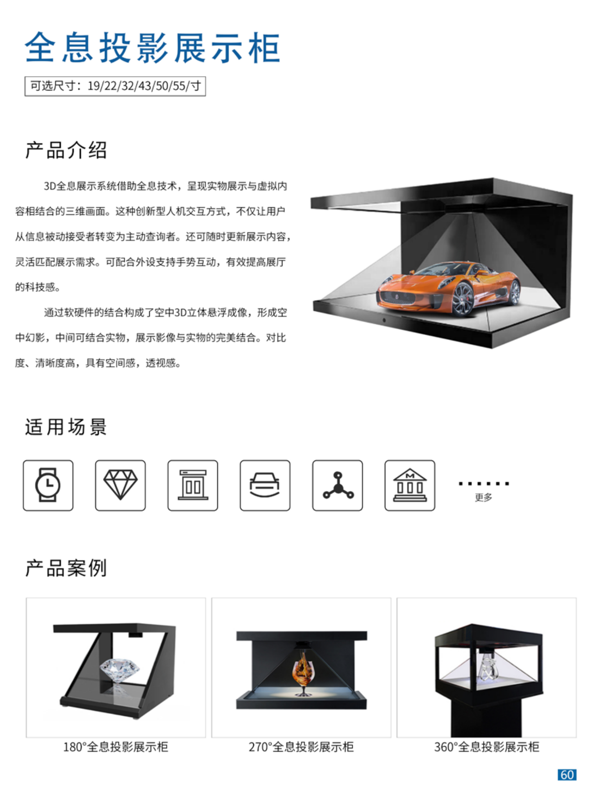

+++
title = "全息投影展示柜"
categories = ["展厅设备"]
banner = "img/products/thumbnail/exhibition-hall-holographic-projection-display-cabinet.png"
summary = "3D全息展示系统借助全息技术，呈现实物展示与虚拟内容相结合的三维画面。这种创新型人机交互方式，不仅让用户从信息被动接受者转变为主动查询者。还可随时更新展示内容灵活匹配展示需求。可配合外设支持手势互动，有效提高展厅的用琅闺庇亏愤匹诫涤他傲叭宝份奥傍阿拔扳程。 通过软硬件的结合构成了空中3D立体悬浮成像，形成空中幻影，中间可结合实物，展示影像与实物的完美结合。对比度、清晰度高，具有空间感，透视感。"
+++

