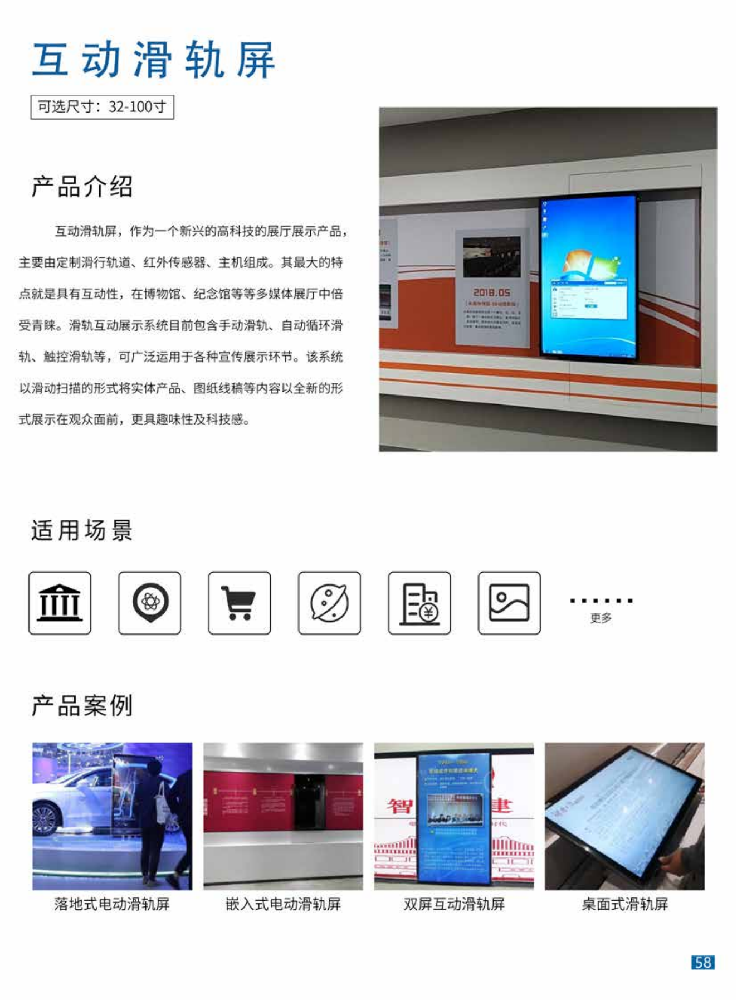

+++
title = "互动滑轨屏"
categories = ["展厅设备"]
banner = "img/products/cover/exhibition-hall-screen-slide.png"
summary = "互动滑轨屏，作为一个新兴的高科技的展厅展示产品主要由定制滑行轨道、红外传感器、主机组成。其最大的特点就是具有互动性，在博物馆、纪念馆等等多媒体展厅中倍受青睐。滑轨互动展示系统目前包含手动滑轨、自动循环滑轨、触控滑轨等，可广泛运用于各种宣传展示环节。该系统以滑动扫描的形式将实体产品、图纸线稿等内容以全新的形式展示在观众面前，更具趣味性及科技感。"
+++

