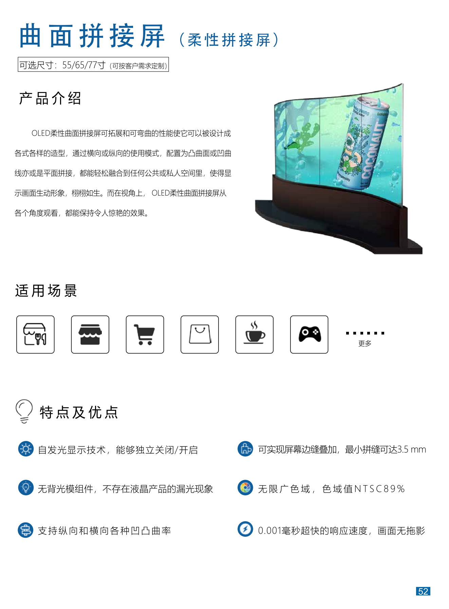
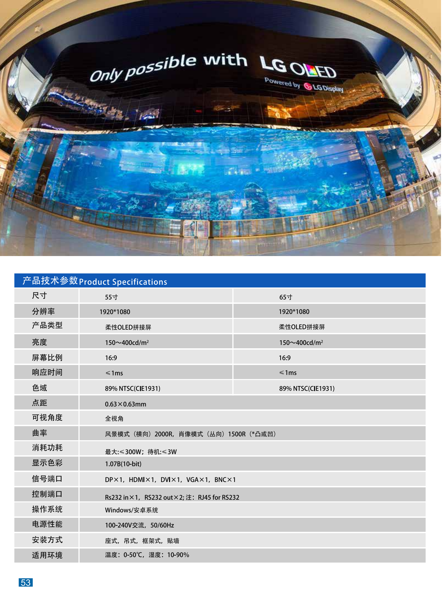

+++
title = "曲面拼接屏"
categories = ["新型商用设备"]
banner = "img/products/thumbnail/new-commercial-screen-curved-stitching.png"
summary = "OLED柔性曲面拼接屏可拓展和可弯曲的性能使它可以被设计成各式各样的造型，通过横向或纵向的使用模式，配置为凸曲面或凹曲线亦或是平面拼接，都能轻松融合到任何公共或私人空间里，使得显示画面生动形象，栩栩如生。而在视角上， OLED柔性曲面拼接屏从各个角度观看，都能保持令人惊艳的效果。"
+++

