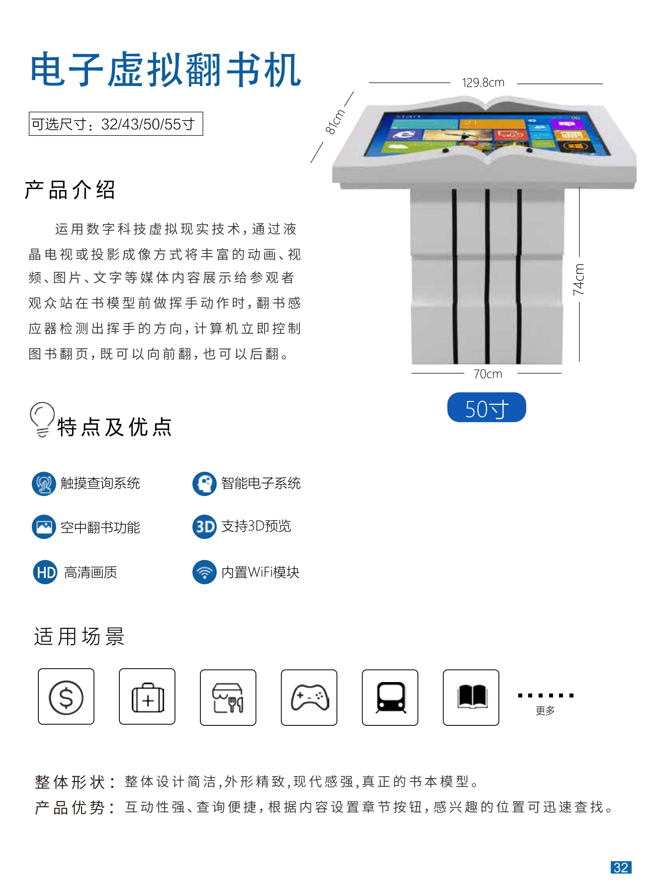
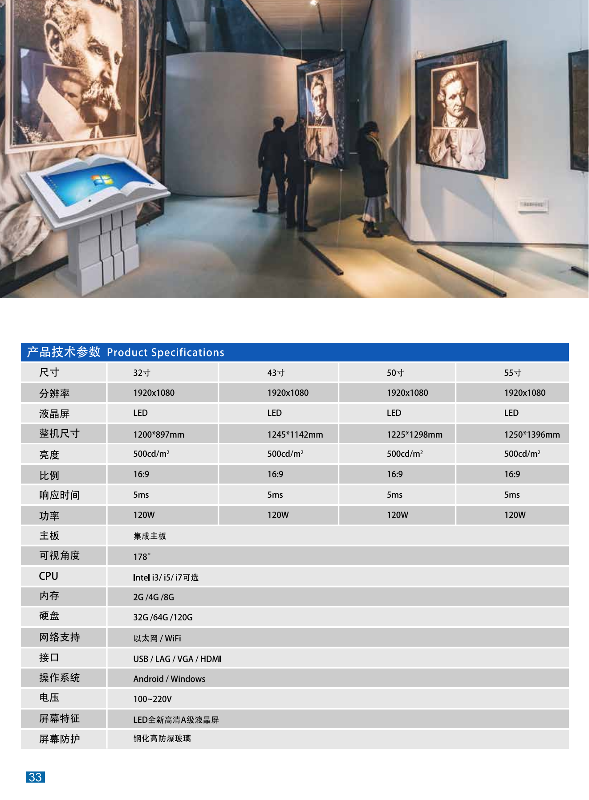

+++
title = "电子虚拟翻书机"
categories = ["自助互交设备"]
banner = "img/products/cover/self-service-mutual-book-flipper.png"
summary = "运用数字科技虚拟现实技术，通过液晶电视或投影成像方式将丰富的动画、视频、图片、文字等媒体内容展示给参观者观众站在书模型前做挥手动作时，翻书感应器检测出挥手的方向，计算机立即控制图书翻页，既可以向前翻，也可以后翻。s"
+++

