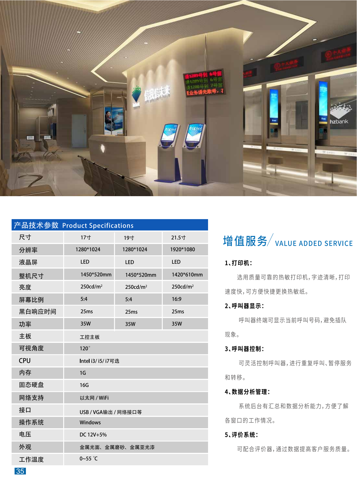

+++
title = "排队叫号机"
categories = ["自助互交设备"]
banner = "img/products/cover/self-service-mutual-queuing.png"
summary = "排队叫号机通俗的称号是排队机、取号机或叫号机，专业称谓是排队管理系统，是一种综合运用计算机技术、网络技术、多媒体技术、通讯控制技术的高新技术产品，能有效地代替客户进行排队。"
+++

