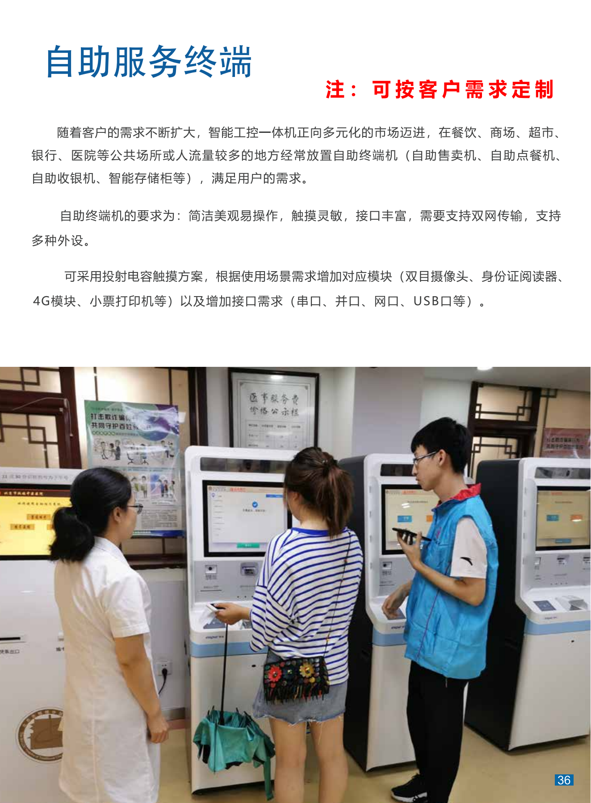
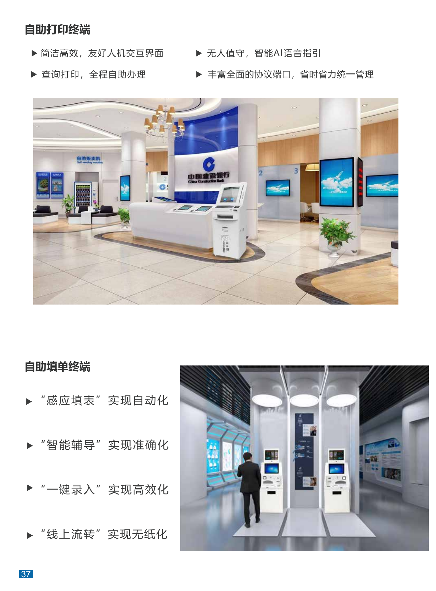

+++
title = "自助服务终端"
categories = ["自助互交设备"]
banner = "img/products/thumbnail/self-service-mutual-self-help.png"
summary = "随着客户的需求不断扩大，智能工控一体机正向多元化的市场迈进，在餐饮、商场、超市银行、医院等公共场所或人流量较多的地方经常放置自助终端机 (自助售卖机、自助点餐机自助收银机、智能存储柜等)，满足用户的需求。 自助终端机的要求为:简洁美观易操作，触摸灵敏，接口丰富，需要支持双网传输，支持多种外设。 可采用投射电容触摸方案，根据使用场景需求增加对应模块 (双目摄像头、身份证阅读器4G模块、小票打印机等) 以及增加接口需求 (串口、并口、网口、USB口等)。"
+++

