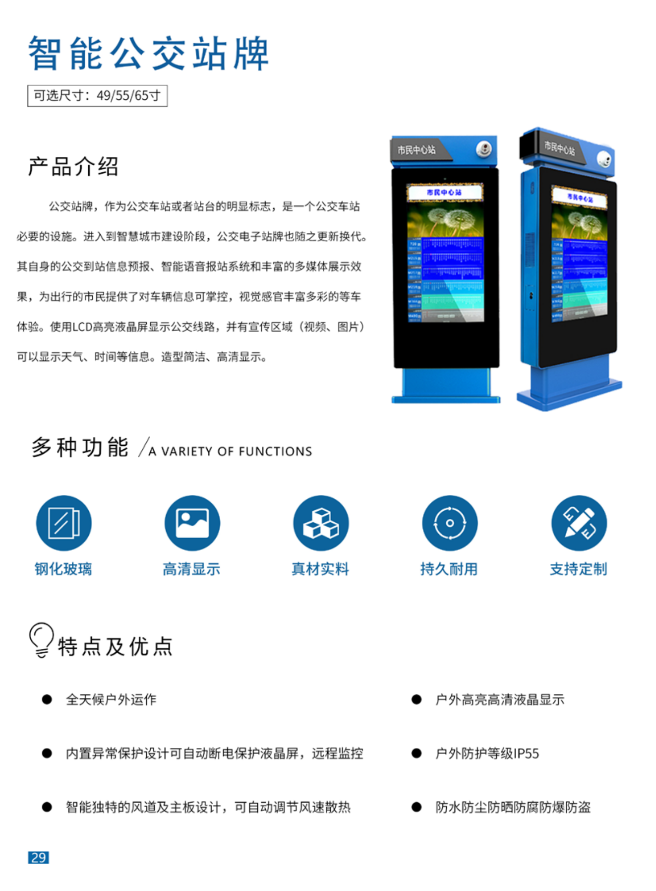

+++
title = "智能公交站牌"
categories = ["智慧商显设备"]
banner = "img/products/thumbnail/smart-commercial-display-bus-stopboard.png"
summary = "公交站牌，作为公交车站或者站台的明显标志，是一个公交车站必要的设施。进入到智慧城市建设阶段，公交电子站牌也随之更新换代其自身的公交到站信息预报、智能语音报站系统和丰富的多媒体展示效果，为出行的市民提供了对车辆信息可掌控，视觉感官丰富多彩的等车体验。使用LCD高亮液晶屏显示公交线路，并有宣传区域 (视频、图片)可以显示天气、时间等信息。造型简洁、高清显示。"
+++

