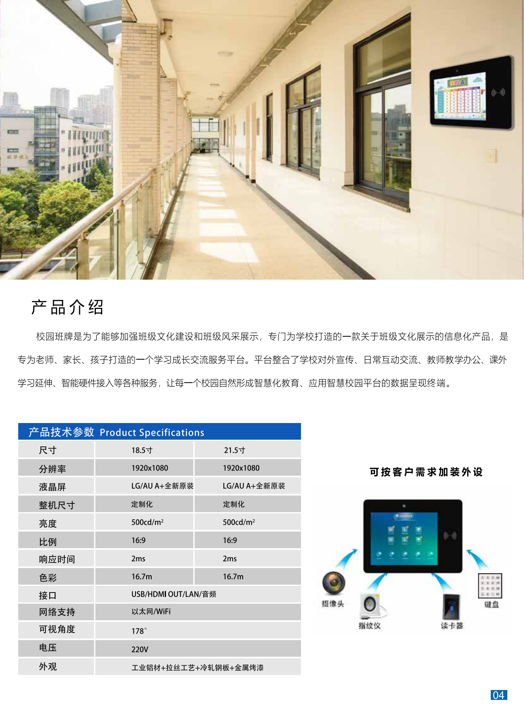

+++
title = "校园班牌"
categories = ["智慧教学设备"]
banner = "img/products/cover/smart-teaching-classcard.png"
summary = "校园班牌是为了能够加强班级文化建设和班级风采展示，专门为学校打造的一款关于班级文化展示的信息化产品，是专为老师、家长、孩子打造的一个学习成长交流服务平台。平台整合了学校对外宣传、日常互动交流、教师教学办公、课外学习延伸、智能硬件接入等各种服务，让每一个校园自然形成智慧化教育、应用智慧校园平台的数据呈现终端。"
+++

