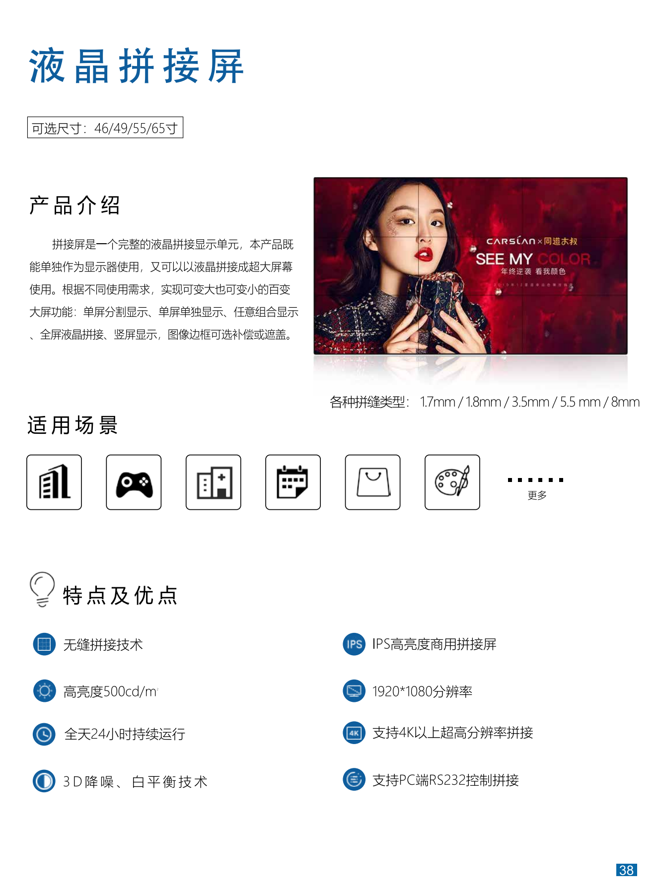
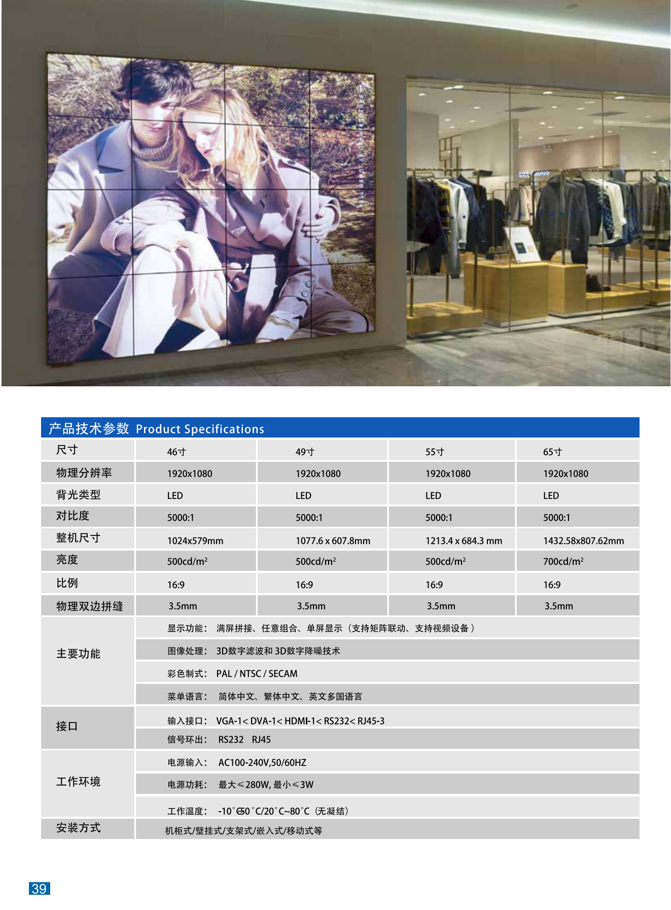
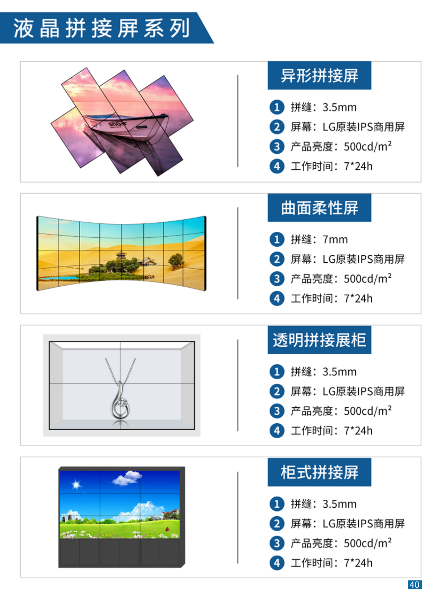

+++
title = "液晶拼接屏"
categories = ["拼接商用大屏"]
banner = "img/products/thumbnail/splicing-commercial-large-screens-lcd.png"
summary = "拼接屏是一个完整的液晶拼接显示单元，本产品既能单独作为显示器使用，又可以以液晶拼接成超大屏幕使用。根据不同使用需求，实现可变大也可变小的百变大屏功能:单屏分割显示、单屏单独显示、任意组合显示全屏液晶拼接、竖屏显示，图像边框可选补偿或遮盖。"
+++

