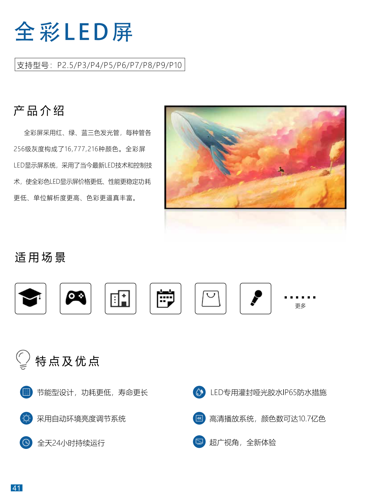
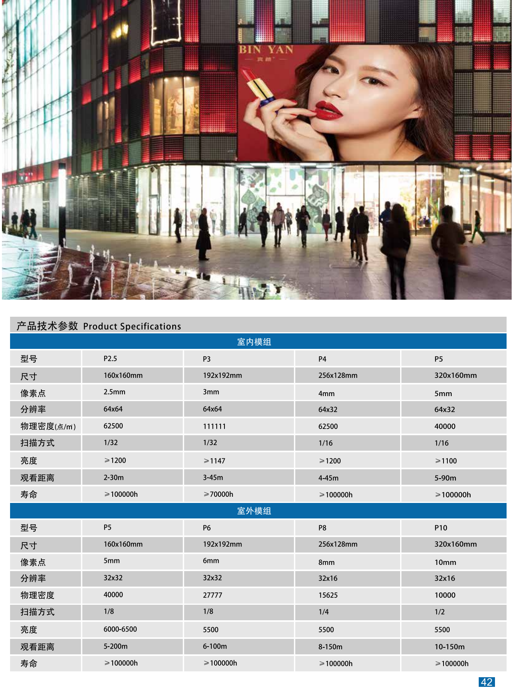
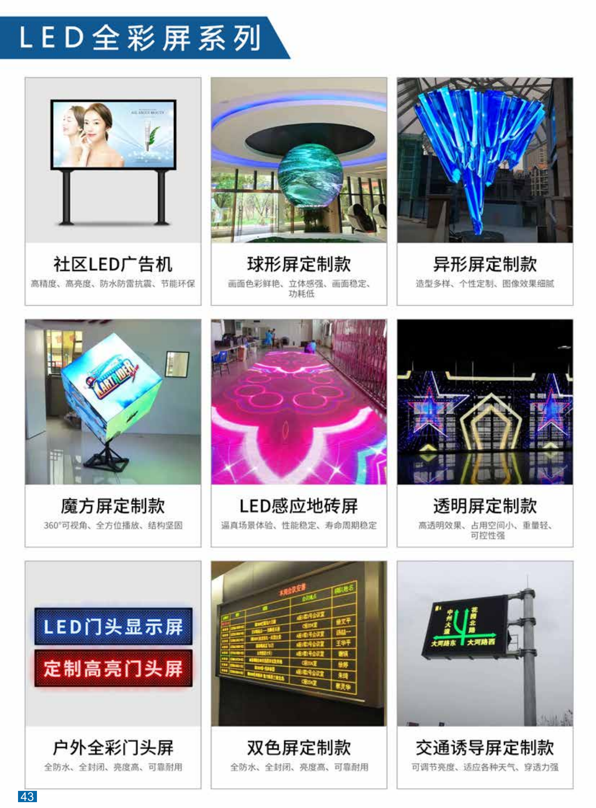

+++
title = "全彩LED屏"
categories = ["拼接商用大屏"]
banner = "img/products/thumbnail/splicing-commercial-large-screens-led.png"
summary = "全彩屏采用红、绿、蓝三色发光管，每种管各256级灰度构成了16,777,216种颜色。全彩屏LED显示屏系统，采用了当今最新LED技术和控制技术，使全彩色LED显示屏价格更低、性能更稳定功耗更低、单位解析度更高、色彩更逼真丰富。"
+++

